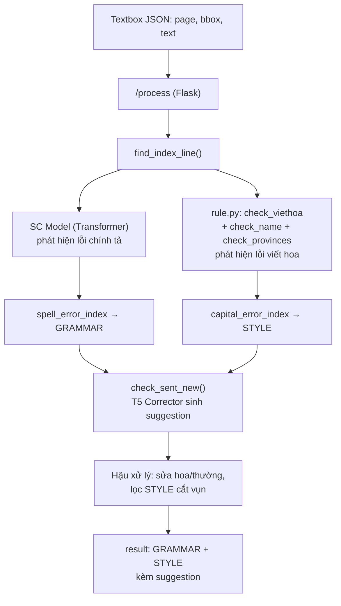
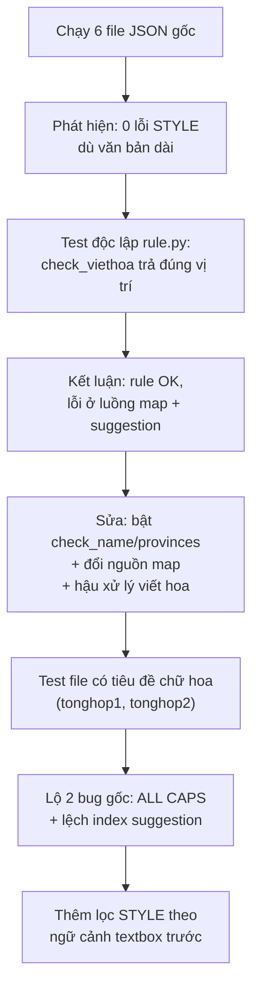
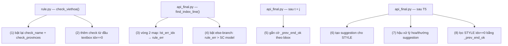
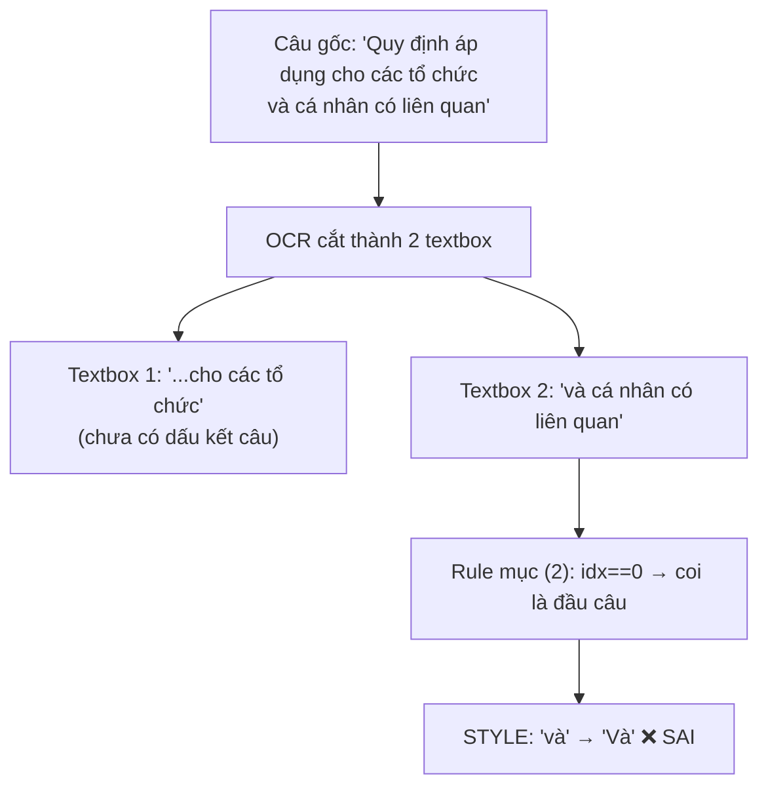
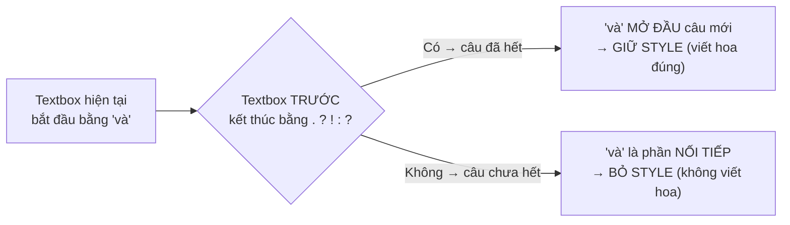
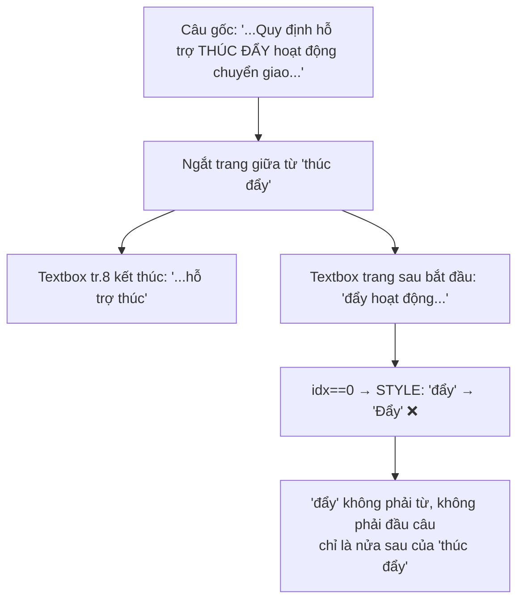
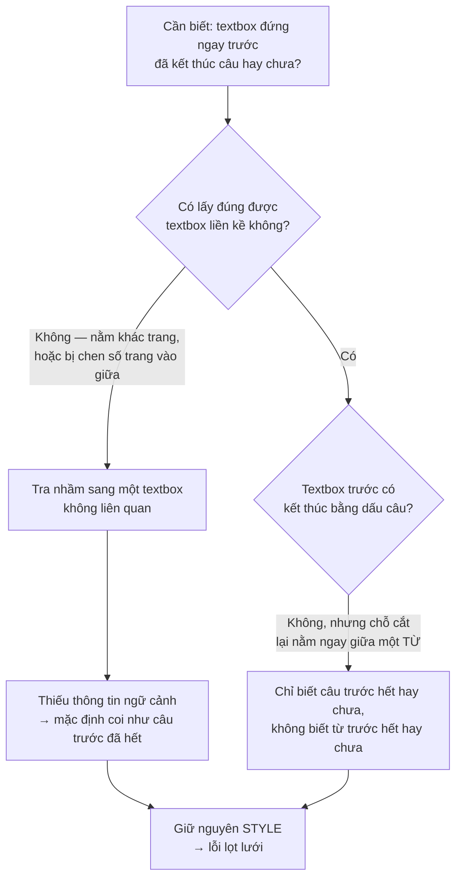
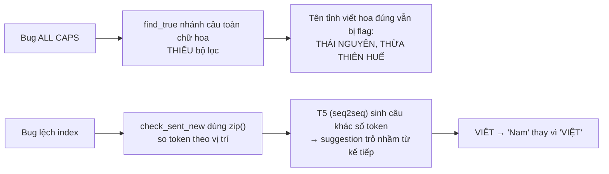

# Tổng hợp dự án — Phương pháp 1: Cải thiện hệ thống phát hiện lỗi chính tả bằng rule & hậu xử lý

## 1. Bối cảnh & mục tiêu

Hệ thống hiện tại (SC Model + T5 Corrector) dùng để kiểm tra chính tả cho các file JSON textbox trích xuất từ PDF văn bản hành chính. Ở phương pháp này, mục tiêu đặt ra là cải thiện khả năng phát hiện lỗi — nhất là lỗi viết hoa (quy tắc là **KHÔNG được đụng vào logic model/thuật toán gốc**, chỉ được phép thêm tiền/hậu xử lý hoặc bật lại những đoạn code đang bị comment sẵn để không vô tình phá hỏng luồng code).

Mọi thay đổi gói trong 3 dạng: (a) thêm bước xử lý độc lập, (b) bật lại code có sẵn đang bị tắt, (c) sửa 1 tham số nhỏ để vá bug phân loại.

## 2. Kiến trúc hệ thống



## 3. Flow chẩn đoán & xử lý



Lúc đầu chạy thử 6 file gốc, thấy STYLE ra toàn 0 dù văn bản dài cả chục trang => vô lý. Test riêng `check_viethoa` thì rule vẫn trả đúng vị trí lỗi, nên có thể loại trừ khả năng rule sai, vấn đề nằm ở khâu map kết quả và sinh suggestion phía sau. Sau khi sửa (bật lại `check_name`/`check_provinces`, đổi nguồn map, thêm hậu xử lý viết hoa), test lại với 2 file có tiêu đề viết hoa (`tonghop1`, `tonghop2`) thì mới lộ ra 2 bug nằm sẵn trong code gốc (ALL CAPS và lệch index - mục 7), đồng thời cũng phát sinh thêm vấn đề về ngữ cảnh textbox nên phải thêm bước lọc.

## 4. Các thay đổi đã thực hiện

### rule.py

| # | Thay đổi | Loại | Giải quyết |
|---|---|---|---|
| 1 | Gộp 2 bản `check_viethoa`, bật lại `check_name()` + `check_provinces()` | Bật lại code comment | Phát hiện được lỗi viết hoa tên riêng, địa danh |
| 2 | Thêm kiểm tra từ đầu textbox (idx==0) | Thêm mới | Từ đầu mỗi textbox được đưa vào kiểm tra viết hoa |

### api_final.py

| # | Thay đổi | Loại | Giải quyết |
|---|---|---|---|
| 3 | Đổi `lst_err_idx` → `rule_err` ở vòng 2 map | Sửa 1 tham số | Tách được lỗi viết hoa ra khỏi lỗi gộp, tránh mất STYLE |
| 4 | Bật lại else-branch: rule_err ưu tiên hơn SC model | Bật lại code comment | Vị trí trùng giữa spell + viết hoa được phân loại đúng thành STYLE |
| 5 | Gắn cờ `_prev_end_ok` theo bbox (lấy từ json_data gốc) | Thêm mới | Biết được textbox trước đó đã kết thúc câu hay chưa |
| 6 | Tạo suggestion cho lỗi STYLE (viết hoa chữ đầu) | Thêm mới | STYLE không bị lọc mất vì suggestion rỗng |
| 7 | Hậu xử lý sửa hoa/thường suggestion | Thêm mới | Suggestion ra đúng hoa/thường cho tên riêng, cho từ sau dấu câu |
| 8 | Lọc STYLE idx==0 theo ngữ cảnh textbox trước | Thêm mới | Bỏ được các case viết hoa nhầm ở textbox bị cắt vụn (ô bảng) |

### 4.1. Vị trí các thay đổi trong luồng



### 4.2. Chi tiết từng thay đổi (kèm code)

**(1) Gộp 2 bản `check_viethoa()` — bật lại `check_name()` + `check_provinces()`** *(rule.py)*

Code gốc có 2 hàm trùng tên `check_viethoa()`; bản active chỉ có logic flag-based (check từ sau dấu câu), bản gọi `check_name()`/`check_provinces()` bị comment → tên riêng và địa danh không được kiểm tra. Gộp thành 1 hàm active, bật lại 2 lời gọi:

```python
err = check_provinces(new_text)
for i in err:
    lst_err.append(mapping[i])
err = check_name(new_text)
for i in err:
    lst_err.append(mapping[i])
lst_err = list(set(lst_err))
lst_err.sort()
```

**(2) Thêm kiểm tra từ đầu textbox (idx == 0)** *(rule.py)*

`check_viethoa()` gốc chỉ soi từ đứng *sau* dấu `.?!` → từ đầu tiên của mỗi textbox không bao giờ được kiểm tra. Bổ sung trước vòng flag-based:

```python
# check tu dau textbox: gia dinh moi textbox la 1 cau hoan chinh
words = new_text.split()
if words and words[0] not in string.punctuation:
    if words[0][0] != words[0][0].upper():
        lst_err.append(mapping[0])
```

Giả định "mỗi textbox = 1 câu hoàn chỉnh" ở đây chính là nguồn gốc bug ở mục 5.

**(3) Đổi tham số vòng 2 để không mất STYLE** *(api_final.py)*

Vòng 2 trong `find_index_line()` dùng `lst_err_idx` (gộp cả spelling + viết hoa) → vị trí nào đã vào `error_index` từ spell check thì bị bỏ qua, mất STYLE. Sửa 1 dòng:

```python
# TRƯỚC:
ans = find_index(len_line, len_sent, lst_err_idx)

# SAU:
ans = find_index(len_line, len_sent, rule_err)
```

**(4) Bật lại else-branch — ưu tiên rule_err hơn SC model** *(api_final.py)*

Khi SC model và rule cùng bắt 1 vị trí (ví dụ "công"), `if j not in error_index` trả False → không vào được `capital_error_index`. Bỏ comment else-branch có sẵn:

```python
if j not in ori_box[i]["error_index"]:
    ori_box[i]["capital_error_index"].append(j)
    ori_box[i]["error_index"].append(j)
else:
    # uu tien rule_err (viet hoa) hon SC model (spelling)
    ori_box[i]["spell_error_index"].remove(j)
    ori_box[i]["capital_error_index"].append(j)
```

**(5) Gắn cờ `_prev_end_ok`** *(api_final.py — sau `t = j`, trước `logger.info(...)`)*

```python
# map: bbox -> textbox truoc co ket thuc cau khong (dua tren json_data GOC, day du)
_prev_end_by_bbox = {}
for _k in range(len(json_data)):
    if not isinstance(json_data[_k], dict):
        continue
    _cur_bbox = tuple(json_data[_k].get('bbox', []))
    _prev = json_data[_k-1].get('text','').strip() if _k > 0 and isinstance(json_data[_k-1], dict) else ''
    _prev_end_by_bbox[_cur_bbox] = (_prev == '' or _prev.endswith(('.','?','!',':')))
for a in t:
    a['_prev_end_ok'] = _prev_end_by_bbox.get(tuple(a.get('bbox', [])), True)
```

Dùng `bbox` làm khóa tra cứu, không dùng index của `t` — vì `t` chỉ chứa textbox CÓ lỗi nên index lệch so với `json_data` gốc.

**(6) Tạo suggestion cho lỗi STYLE** *(api_final.py — sau T5, trước bộ lọc đầu tiên)*

T5 không sửa lỗi viết hoa nên STYLE luôn có `suggestion = ""` và bị bộ lọc `suggestion != ""` xóa sạch — đây là lý do 6 file gốc ra 0 STYLE:

```python
for a in t:
    for g in a['result']:
        if g['type'] == 'STYLE':
            word = a['text'].split()[g['index']]
            g['suggestion'] = word[0].upper() + word[1:]
```

Không thêm điều kiện `g['suggestion'] == ""` để ghi đè luôn trường hợp T5 lỡ gán sai (chữ thường).

**(7) Hậu xử lý sửa hoa/thường cho suggestion** *(api_final.py — sau tất cả bộ lọc)*

T5 (BARTpho) sinh suggestion toàn chữ thường, trong khi tên riêng hoặc từ sau dấu `.?!` phải viết hoa:

```python
# === HAU XU LY: sua hoa/thuong cho suggestion ===
for a in t:
    words = a['text'].split()
    for g in a['result']:
        idx = g['index']
        if idx >= len(words):
            continue
        original = words[idx]
        sug = g['suggestion']
        if not sug:
            continue
        # 1) tu goc viet hoa chu dau (ten rieng) -> suggestion cung phai viet hoa
        is_proper = original[:1].isupper()
        # 2) tu dung sau dau cau .?! -> viet hoa
        is_sentence_start = False
        if idx > 0:
            prev = words[idx-1]
            if prev and prev[-1] in ".?!":
                is_sentence_start = True
        if (is_proper or is_sentence_start) and sug[:1].islower():
            g['suggestion'] = sug[0].upper() + sug[1:]
```

Cố ý **không** cho `idx == 0` tự động thành `is_sentence_start` (OCR chia block giữa câu → false positive); việc bắt từ đầu câu đã giao cho `check_viethoa()` ở mục (2).

**(8) Lọc STYLE idx==0 theo ngữ cảnh textbox trước** *(api_final.py — trước `logger.info("Response...")`)*

```python
# loc STYLE bi bat nham o textbox cat vun (dua ngu canh textbox truoc)
for a in t:
    if not a.get('_prev_end_ok', True):
        a['result'] = [g for g in a['result'] if not (g['type']=='STYLE' and g['index']==0)]
for a in t:
    a.pop('_prev_end_ok', None)   # xoa co noi bo, khong tra ve client
t = list(filter(lambda x: len(x['result']) > 0, t))
```

**Không đụng tới:** SC model, pipeline T5/BARTpho, `find_index()`, `parallel_index()`, `reverse()`, `check_sent_new()`, thân `check_name()` / `check_provinces()`, toàn bộ logic detect trong `find_index_line()`.

## 5. Cơ chế xử lý viết hoa theo ngữ cảnh (điểm nổi bật)

### 5.1. Bug phát sinh: gắn cờ viết hoa nhầm cho từ nối

Sau khi thêm mục (2), chạy trên dữ liệu thật (`tonghop2`) thì rule gắn cờ viết hoa SAI cho các từ nối/giới từ đứng đầu ô bảng.



Các từ hay bị bắt nhầm: `và`, `của`, `để`, `các`... — từ nối/giới từ **giữa câu**, rơi vào vị trí đầu textbox do bảng bị cắt ngang.

### 5.2. Vì sao không dùng danh sách từ cứng

Phương án lập danh sách "từ không viết hoa" (và, của, để...) rồi trùng thì bỏ STYLE bị loại, vì sai về mặt ngôn ngữ — các từ này vẫn viết hoa được khi thật sự đứng đầu câu:
- "Và tôi đã đến đó."
- "Để làm được điều này..."

### 5.3. Phương pháp đã áp dụng: nhìn ngữ cảnh textbox liền trước

Thay vì đoán qua bản thân từ, xét **textbox liền trước đã kết thúc câu hay chưa**:



**Kiểm chứng sau khi sửa:**

| Input | Kết quả sau khi sửa |
|---|---|
| Textbox trước "...các tổ chức" (chưa hết câu) + "và cá nhân..." | `[]` — bỏ STYLE, đúng |
| Textbox trước "...đã ban hành." (đã hết câu) + "và các bên..." | STYLE "Và" — giữ đúng |

Cơ chế gồm 2 đoạn: đoạn tính cờ `_prev_end_ok` từ `json_data` gốc theo bbox (code mục 5), và đoạn dùng cờ đó lọc STYLE idx==0 rồi xóa cờ trước khi trả về client (code mục 8).

### 5.4. Trường hợp biên: cắt ngay giữa từ, không chỉ giữa câu

Mục 5.3 xử lý được trường hợp cắt đúng **ranh giới từ**. Chạy thêm dữ liệu mới thì log lộ dạng nặng hơn: textbox bị cắt ngay **giữa một từ / cụm từ**.



**Ví dụ 1 — cắt ngang trang, giữa từ ghép "thúc đẩy"** (ảnh 1):

```
[tr.8] STYLE: 'đẩy' idx=0 -> Đẩy
    text: đẩy hoạt động chuyển giao, ứng dụng, đổi mới công nghệ trên địa bàn tỉnh An Giang ban hành kèm theo
```

**Ví dụ 2 — cắt giữa cụm "một số điều"** (ảnh 2):

```
[tr.7] STYLE: 'điều' idx=0 -> Điều
    text: điều và biện pháp để tổ chức, hướng dẫn thi hành Luật Ban hành văn bản quy phạm pháp luật được sửa đ
```

"điều" ở đây tiếp nối cụm "một số điều", không phải "Điều 1", "Điều 2" như trong văn bản luật.

**Ví dụ 3 — mảnh vụn còn sót, không còn là từ:**

```
[tr.8] STYLE: 'y.' idx=0 -> Y.
    text: y.
```

Textbox chỉ có 2 ký tự "y." — phần đuôi còn sót của một từ dài hơn bị OCR cắt gần hết.

**Vì sao `_prev_end_ok` chưa chặn được:**



Gốc rễ nằm ở khâu tách textbox từ PDF (chia sai ranh giới, thậm chí giữa thân từ), không nằm trong `find_true` hay `check_sent_new` — rule ở tầng ngôn ngữ khó xử lý triệt để vì không còn đủ thông tin để biết "y." hay "đẩy" từng thuộc về từ nào.

## 6. Kết quả

### Các case đã fix (kiểm chứng thực tế)

| Trường hợp | Trước fix | Sau fix |
|---|---|---|
| "Nguyen" (tên riêng thiếu dấu) | suggestion "nguyễn" (thường) | "Nguyên" (hoa) ✓ |
| "cong ty" đầu câu (sai chính tả + đầu câu) | không phát hiện, ra `[]` | STYLE "Công" ✓ |
| "công ty" đầu câu (đúng chính tả, chỉ sai hoa) | `[]` | STYLE "Công" ✓ |
| "và bbb" sau câu CHƯA hết (ô bảng cắt) | STYLE "Và" (sai) | `[]` (bỏ đúng) ✓ |
| "và bbb" sau câu ĐÃ hết | — | STYLE "Và" (giữ đúng) ✓ |

### Kết quả chạy dữ liệu thật

- **6 file JSON gốc:** ~72 textbox bị đánh dấu, chỉ ~7 lỗi chính tả thật, còn lại là nhiễu (con dấu chữ ký số bị OCR cắt, tên riêng thiếu ký tự, tiếng Anh xen lẫn).
- **2 file tonghop:** bắt đúng lỗi thật (kêt→kết, tao→tạo, tuyên→tuyến, hơp→hợp) và lỗi viết hoa đầu câu; đồng thời lộ 2 bug gốc (mục 7) cùng các case cắt textbox ở mục 5.4.

## 7. Hạn chế còn lại — 2 bug CÓ SẴN trong code gốc



**Bug ALL CAPS:** nhánh xử lý ALL CAPS trong `find_true()` thiếu bộ lọc mà nhánh câu thường có. Bằng chứng: box "ỦY BAN NHÂN DÂN TỈNH THÁI NGUYÊN" sạch hoàn toàn vẫn báo lỗi; cùng nội dung viết thường thì ra `[]`.

**Bug lệch index:** `check_sent_new` dùng `zip(input, output)` so token theo vị trí, nhưng T5 là seq2seq sinh lại cả câu với số token không cố định → suggestion trỏ sang từ kế tiếp. Bằng chứng bổ sung: "NỘI DUNG / 199225_ / Giam doc" trả index=3 ("Giam") nhưng suggestion "Đốc" là bản sửa của "doc" ở index 4.

**Các hạn chế khác:**
- Tên riêng gõ thường hoàn toàn giữa câu ("nguyen duc cuong") không viết hoa được — thiếu tín hiệu chữ hoa gốc / đầu câu.
- `check_provinces` chỉ bắt địa danh sai hoa khi ĐÚNG dấu; địa danh thiếu dấu (phổ biến trong OCR) do model spelling xử lý, dính bug hoa/thường.
- Nhiễu vẫn cao với văn bản dạng bảng / OCR cắt vụn, kể cả sau khi thêm lọc ở mục 5.3.

Hai bug này nằm sâu trong luồng phát hiện & sinh suggestion, sửa triệt để có rủi ro ảnh hưởng phần đang chạy đúng nên chưa đụng vào — đề xuất để tác giả code gốc rà lại, hoặc dùng tầng LLM thẩm định (Phương pháp 2) để lọc.

Nhìn chung, phương pháp này giải quyết được phần lớn lỗi viết hoa chỉ bằng rule đơn giản cộng hậu xử lý theo ngữ cảnh, mà không phải động vào logic gốc. Những gì còn lại đều là giới hạn nằm ở tầng model/thuật toán và tầng trích xuất dữ liệu — nên hướng hợp lý là bổ sung thêm một tầng thẩm định bằng LLM (Phương pháp 2) để lọc, thay vì sửa sâu vào code gốc vốn rủi ro cao.
